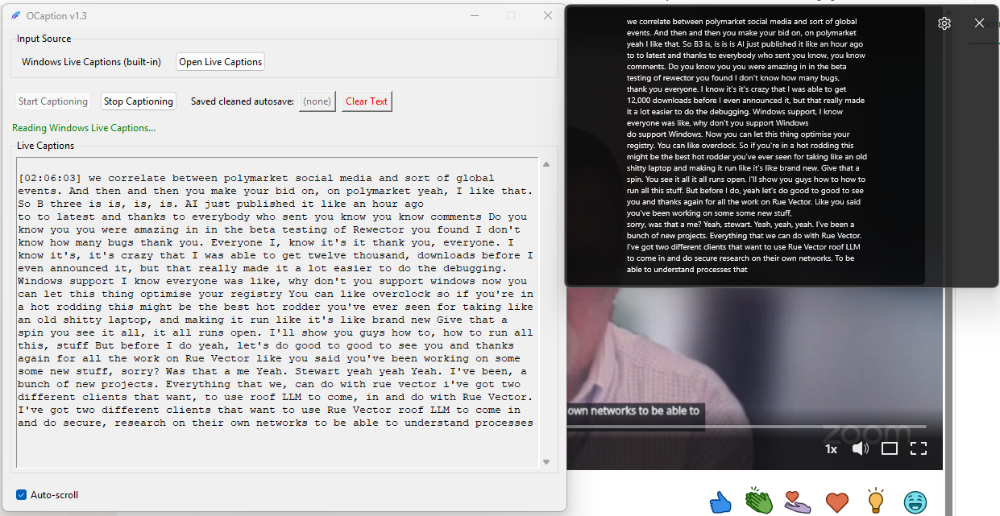

# OCaption

> [!IMPORTANT]
> **Work In Progress (WIP)**: This project is currently under active development. You may encounter bugs, performance issues, or UI inconsistencies.
>
> **Project Context**: OCaption relies on Windows UI Automation (`pywinauto`) to "scrape" text from the system's Live Captions window. Because Microsoft frequently updates the UI structure of Live Captions, detection results may vary between Windows versions (Windows 10 vs Windows 11) or localized system languages. This is a community-driven tool and is not officially affiliated with Microsoft.

OCaption is a lightweight Windows desktop utility designed to enhance the experience of using **Windows Live Captions**. It provides a persistent, cleaned, and timestamped transcript of your live captions, making it easy to save and review conversations, meetings, or videos.



## Core Features

- **Live Captions Integration**: Automatically detects and read Windows Live Captions using UI Automation.
- **Real-Time Deduplication**: Intelligent algorithm that filters out repeated words and "stutter" common in live transcription.
- **Automatic Cleaning**: When you stop captioning, the app performs a final "deep clean" to ensure the transcript is readable and concise.
- **Smart Autosave**: Every session is timestamped and saved to the `transcript/` folder automatically.
- **Hyperlinked Access**: Once saved, a clickable button appears in the UI to open the cleaned file immediately.
- **One-Click Activation**: Easily toggle Windows Live Captions (Win+Ctrl+L) directly from the app.
- **Minimalist UI**: Clean, native Windows interface with auto-scroll and red-text "Clear" safety.

## How to Use

1. **Launch OCaption**: Run the application (or the built EXE).
2. **Open Live Captions**: Click "Open Live Captions" if it's not already running. Windows Live Captions must be active for OCaption to grab text.
3. **Start Captioning**: Click the "Start Captioning" button. The app will begin monitoring the captions and showing them with timestamps.
4. **Stop & Save**: Click "Stop Captioning". The app will immediately:
   - Apply a final cleaning pass.
   - Overwrite the current session's autosave file with the clean text.
   - Provide a blue hyperlinked button (e.g., `20260120_004848.txt`) to open the file.
   - **Locating Files**: All transcripts are stored in a folder named `transcript/` located in the same directory as the OCaption program file. You can access this folder at any time to find your historical recordings.
5. **Clear**: Use the "Clear Text" button to reset the view for a new session.

## Installation (Development)

Requires Python 3.10+ and Windows 10/11.

```bash
# Clone the repository
git clone https://github.com/designcodecraft/OCaption.git
cd OCaption

# Install dependencies
pip install pywinauto
```

## Building the EXE

The project includes a `build_exe.bat` script that uses PyInstaller to create a single-file executable with the correct metadata and icon.

```batch
.\build_exe.bat
```
The result will be available in the `dist/` folder.

## Metadata

The application title, version, and icon are managed via `app_meta.json`. Update this file to change the build information.

## Licenses & Dependencies

### Core Runtime
- **pywinauto** (BSD 3-Clause) — UI Automation for reading Windows Live Captions

### Development / Optional
- **Pillow** (HPND License) — Only needed if regenerating the app icon via `create_icon.py`

### Build Tools
- **PyInstaller** (GPL 2.0) — Used only for building the EXE; not shipped in the runtime executable.

**License Compliance**: OCaption source code and distributions contain no GPL-licensed runtime dependencies. PyInstaller is a build-time-only tool.

---
*Created by [designcodecraft](https://github.com/designcodecraft)*
>>>>>>> f1ffff1 (Initial commit of OCaption project)
